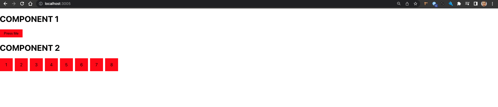
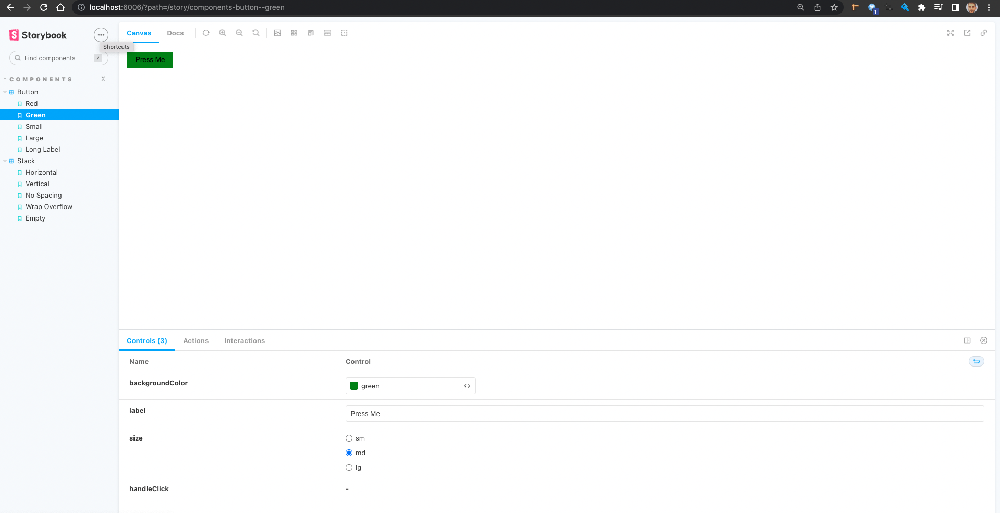
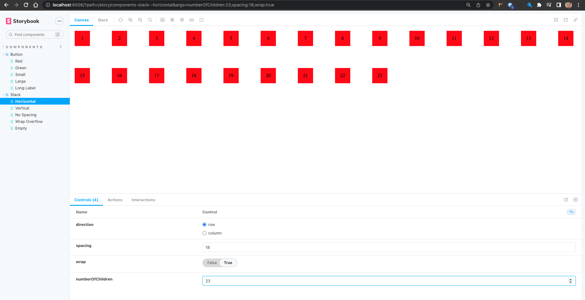

# Getting Started with Storybook

[Documentation](https://storybook.js.org/docs/react/get-started/introduction)

## Introduction

Designing and testing components is crucial to every application, but it can be difficult to view components in isolation. This makes it hard to design and test components, but with Storybook this is no longer an issue. Storybook makes developing, testing, and working with a component library so much easier. You can test complex actions and ensure your components are always working as expected. In this video I will be showing you how to setup Storybook in React and how to create everything from basic to more advanced stories.

### Component 1 : Button

### Component 2 : Stack

